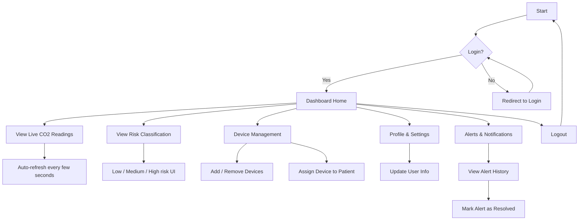

# User Flow

```mermaid
flowchart TD
    A[Start] --> B{Login?}
    B -- Yes --> C[Dashboard Home]
    B -- No --> D[Redirect to Login]
    D --> B
    C --> E[View Live CO2 Readings]
    C --> F[View Risk Classification]
    C --> G[Device Management]
    C --> H[Profile & Settings]
    C --> I[Alerts & Notifications]
    E --> J[Auto-refresh every few seconds]
    F --> K[Low / Medium / High risk UI]
    G --> L[Add / Remove Devices]
    G --> M[Assign Device to Patient]
    H --> N[Update User Info]
    I --> O[View Alert History]
    O --> P[Mark Alert as Resolved]
    C --> Q[Logout]
    Q --> A
```
